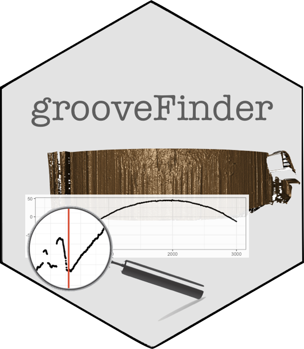

[](https://cran.r-project.org/package=grooveFinder) [](http://www.r-pkg.org/pkg/grooveFinder) 
[](http://www.repostatus.org/#active)
[](https://travis-ci.org/heike/grooveFinder)
[)`-yellowgreen.svg)](/commits/master)
[](https://codecov.io/github/heike/grooveFinder?branch=master)

# grooveFinder 

## Identify groove locations

1. Load libraries for setting things up
```{r, message=FALSE}
library(dplyr)
library(bulletxtrctr)
library(x3ptools)
library(ggplot2)
library(nbtrd) # devtools::install_github("csafe-isu/nbtrd")
```

2. `grooveFinder` only works on x3p files. See package `x3ptools` at https://heike.github.io/x3ptools/ for ways to convert different file formats into x3p standard files.
The NIST Research Ballistics Toolmarks data base (NRBTD)[https://tsapps.nist.gov/NRBTD/Studies/Search] provides access to  scans of bullets and cartridge cases from various case studies.    

We will work with two bullets from a single barrel of the Hamby 252 data set. Links to the 12 scans of bullet lands in x3p format are provided in the `hamby252demo` object.

These commands will read in the bullets directly from the NRBTD repository, without downloading the files into your working directory:

```{r, eval = FALSE}
b1 <- read_bullet(urllist = hamby44demo$bullet1)
b2 <- read_bullet(urllist = hamby44demo$bullet2)
```


```{r, eval = TRUE}
if (!dir.exists("README_files/data")) {
  dir.create("README_files/data")
}
if (!file.exists("README_files/data/bullet1/HS44_Barrel1_Bullet1_Land1.x3p")) {
 # NRBTDsample_download("README_files/data")
}
b1 <- read_bullet("README_files/data/bullet1")
b2 <- read_bullet("README_files/data/bullet2")
```

Combine the results into a single data frame:

```{r}
b1$bullet <- 1
b2$bullet <- 2
b1$land <- 1:6
b2$land <- 1:6
bullets <- rbind(b1, b2)
```

Change measurements to microns and flip scans along y axis:

```{r}
bullets <- bullets %>% mutate(
  x3p = x3p %>% purrr::map(.f = x3p_m_to_mum)
)

# turn the scans such that (0,0) is at the bottom left
bullets <- bullets %>% mutate(
  x3p = x3p %>% purrr::map(.f = function(x) x %>% 
                             y_flip_x3p())
) 

```


2. Get cross sections for each of the lands:

```{r}
bullets <- bullets %>% mutate(
  crosscut = x3p %>% purrr::map_dbl(.f = x3p_crosscut_optimize)
)
# now extract the crosscuts
bullets <- bullets %>% mutate(
  ccdata = purrr::map2(.x = x3p, .y = crosscut, 
                       .f = x3p_crosscut)
)
```

Visualize the cross cuts:
```{r, fig.width = 8, fig.height=3.3}
crosscuts <- bullets %>% tidyr::unnest(ccdata)
crosscuts %>% 
  ggplot(aes(x = x, y = value)) + 
  geom_line() +
  facet_grid(bullet~land, labeller="label_both") +
  theme_bw()
```


3. Get groove locations

```{r}
bullets <- bullets %>% mutate(
  grooves_middle = ccdata %>% 
    purrr::map(.f = cc_locate_grooves, method = "middle", 
               adjust = 30, return_plot = FALSE),
  grooves_rollapply = ccdata %>% 
    purrr::map(.f = cc_locate_grooves, method = "rollapply", 
               adjust = 30, return_plot = FALSE)
  )

bullets <- bullets %>% mutate(
  grooves_hough = x3p %>% purrr::map(.f = x3p_to_df) %>%
    purrr::map(.f = cc_locate_grooves, method = "hough", 
               adjust = 30, return_plot = FALSE)
)
```

Extract groove locations from groove objects:
```{r}
bullets <- bullets %>% mutate(
  grooves_hough = x3p %>% 
    purrr::map(~x3p_to_df(.) %>% 
                 cc_locate_grooves( method = "hough", adjust = 30, return_plot = F, qu = .999))
)
bullets <- bullets %>% mutate(
  middle_left = grooves_middle %>% purrr::map_dbl(.f = function(x) x$groove[1]),
  rollapply_left = grooves_rollapply %>% purrr::map_dbl(.f = function(x) x$groove[1]),
  middle_right = grooves_middle %>% purrr::map_dbl(.f = function(x) x$groove[2]),
  rollapply_right = grooves_rollapply %>% purrr::map_dbl(.f = function(x) x$groove[2])
)

# grooves_hough are functions
# Find the left and right groove locations for the particular cross cuts
bullets <- bullets %>%
  mutate(
    hough_left = purrr::map2_dbl(
      crosscut,
      grooves_hough, 
      .f = function(x, y) {
        y$left.groove.fit(x)
      }),
    hough_right = purrr::map2_dbl(
      crosscut,
      grooves_hough, 
      .f = function(x, y) {
        y$right.groove.fit(x)
      })
  )

# In order to do side-by-side comparisons create new format for hough grooves

bullets <- bullets %>%
  mutate(
    grooves_hough = purrr::map(1:nrow(bullets),
function(x){list(groove = unlist(c(bullets$hough_left[[x]],
                     bullets$hough_right[[x]])))})
  )

# Re-order variables for gather
bullets <- bullets %>%
  select(-matches("hough_fit")) %>%
  select(source:ccdata, matches("grooves"), matches(".*_(left|right)"), everything())
```

Visualize  the grooves to see the differences in identifications between the different methods:

```{r, fig.width = 8, fig.height=3.7}
profilesplus <- bullets %>% tidyr::gather(type_side, location, matches("left|right")) %>%
  tidyr::separate(type_side, into=c("type", "side")) %>%
  tidyr::unnest(ccdata)  # gets rid of all the other list variables 

profilesplus %>% 
  ggplot(aes(x = x/1000, y = value)) +
  facet_grid(bullet~land) +
  geom_line() +
  geom_vline(aes(xintercept=location/1000, colour=type), size=0.75) +
  theme_bw() +
  scale_colour_brewer(palette="Paired") +
  theme(legend.position = "bottom") +
  xlab("Relative location (in millimeters)") +
  ylab("Relative height (in microns)")

```


