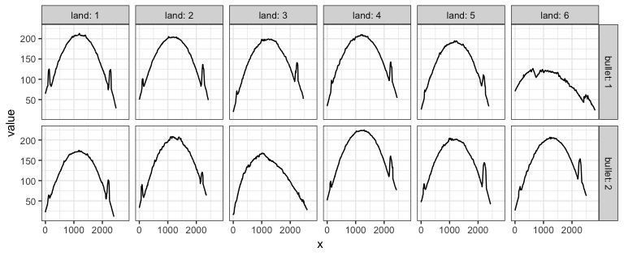
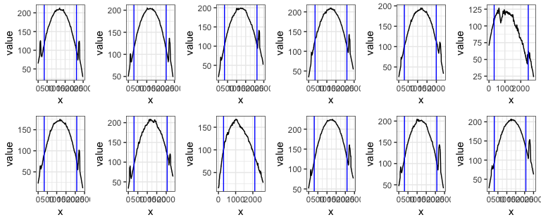

grooveFinder
================
Heike Hofmann, Susan Vanderplas, Kiegan Rice, Nate Garton, Charlotte
Roiger
June 03, 2019

[](https://cran.r-project.org/package=grooveFinder)
[](http://www.r-pkg.org/pkg/grooveFinder)
[](http://www.repostatus.org/#active)
[](https://travis-ci.org/heike/grooveFinder)
[](/commits/master)
[](https://codecov.io/github/heike/grooveFinder?branch=master)

# grooveFinder 

Identify groove locations

Analyze bullet striations using nonparametric methods

## Comparing lands from two bullets

Striae comparisons between bullets are based on land-to-land
comparisons.

1.  Load libraries

<!-- end list -->

``` r
library(dplyr)
library(bulletxtrctr)
library(x3ptools)
library(randomForest)
library(ggplot2)
library(readr)
library(nbtrd) # devtools::install_github("csafe-isu/nbtrd")
```

2.  `bulletxtrctr` only works on x3p files. See package `x3ptools` at
    <https://heike.github.io/x3ptools/> for ways to convert different
    file formats into x3p standard files. The NIST Research Ballistics
    Toolmarks data base
    (NRBTD)\[<https://tsapps.nist.gov/NRBTD/Studies/Search>\] provides
    access to scans of bullets and cartridge cases from various case
    studies.

In this tutorial, we’ll work with two bullets from a single barrel of
the Hamby 252 data set. Links to the 12 scans of bullet lands in x3p
format are provided in the `hamby252demo` object.

These commands will read in the bullets directly from the NRBTD
repository, without downloading the files into your working directory:

``` r
b1 <- read_bullet(urllist = hamby252demo[[1]])
b2 <- read_bullet(urllist = hamby252demo[[2]])
```

Instead, we could also download the files into a folder named “data” in
our working directory. This is shown in the sequence of commands below:

``` r
if (!dir.exists("README_files/data")) {
  dir.create("README_files/data")
}
if (!file.exists("README_files/data/Bullet1/Hamby252_Barrel1_Bullet1_Land1.x3p")) {
  NRBTDsample_download("README_files/data")
}
b1 <- read_bullet("README_files/data/Bullet1")
```

    ## 6 files found. Reading ...

``` r
b2 <- read_bullet("README_files/data/Bullet2")
```

    ## 6 files found. Reading ...

Combine the results into a single data frame:

``` r
b1$bullet <- 1
b2$bullet <- 2
b1$land <- 1:6
b2$land <- 1:6
bullets <- rbind(b1, b2)
```

We expect data to be recorded at the micron level. The scans posted give
measurements in meters:

``` r
bullets$x3p[[1]]$header.info$incrementY
```

    ## [1] 1.5625e-06

``` r
bullets$x3p[[1]]$header.info$incrementX
```

    ## [1] 1.5625e-06

``` r
summary(as.vector(bullets$x3p[[1]]$surface.matrix))
```

    ##    Min. 1st Qu.  Median    Mean 3rd Qu.    Max.    NA's 
    ##       0       0       0       0       0       0   24829

Change measurements to microns:

``` r
bullets <- bullets %>% mutate(
  x3p = x3p %>% purrr::map(.f = x3p_m_to_mum)
)
```

``` r
bullets$x3p[[1]]$header.info$incrementY
```

    ## [1] 1.5625

``` r
bullets$x3p[[1]]$header.info$incrementX
```

    ## [1] 1.5625

``` r
summary(as.vector(bullets$x3p[[1]]$surface.matrix))
```

    ##    Min. 1st Qu.  Median    Mean 3rd Qu.    Max.    NA's 
    ##   1.513 117.626 166.723 155.933 199.429 216.341   24829

We are working under the assumption that the scans are aligned such that
the base of the bullet are at the bottom (y = 0) of the image, and the
land engraved area is displayed left to right from groove to groove,
i.e. we are assuming that (0,0) is in the bottom left corner of the
image. In scans where no adjustment was made for the barrel’s twist (not
recommended) the twist will be visible in the image.

``` r
image_x3p(bullets$x3p[[1]], file = "man/figures/temp-before.png")
```

<!-- -->

The raw scan needs to be flipped such that the heel is along the bottom
of the image rather than along the left hand side.

``` r
# turn the scans such that (0,0) is bottom left
bullets <- bullets %>% mutate(
  x3p = x3p %>% purrr::map(.f = function(x) x %>% 
                             rotate_x3p(angle = -90) %>%
                             y_flip_x3p())
) 
```

Scan after the transformation: a clear right twist is visible in the
right slant of striae and grooves:

``` r
image_x3p(bullets$x3p[[1]], file = "man/figures/temp-after.png")
```

<!-- -->

3.  Get the ideal cross sections

<!-- end list -->

``` r
bullets <- bullets %>% mutate(
  crosscut = x3p %>% purrr::map_dbl(.f = x3p_crosscut_optimize)
)
# now extract the crosscuts
bullets <- bullets %>% mutate(
  ccdata = purrr::map2(.x = x3p, .y = crosscut, 
                       .f = x3p_crosscut)
)
```

Visualize the cross cuts:

``` r
crosscuts <- bullets %>% tidyr::unnest(ccdata)
crosscuts %>% 
  ggplot(aes(x = x, y = value)) + 
  geom_line() +
  facet_grid(bullet~land, labeller="label_both") +
  theme_bw()
```

<!-- -->

Note the rather strange cross cut for land 6 in bullet 1. We can look at
the scan - and find quite pronounced tank rash. However, the extraction
of the land is at a height of 375, which is not as much affected by the
rash as the base of the bullet or the top of the scanning area.

Scan of land 6 on bullet 1. The land is affected by quite pronounced
tank rash:

``` r
filter(bullets, land==6, bullet==1)$x3p[[1]] %>%
  x3p_add_hline(yintercept = 375, size = 10, color = "#e6bf98") %>% 
  image_x3p(file="man/figures/bullet1-land6.png")
```

<!-- -->

4.  Get the groove locations

<!-- end list -->

``` r
bullets <- bullets %>% mutate(
  grooves = ccdata %>% 
    purrr::map(.f = cc_locate_grooves, method = "middle", 
               adjust = 30, return_plot = TRUE)
)
```

Visualize that the grooves are identified correctly (at least enough to
not distort the final result):

``` r
gridExtra::grid.arrange(
  bullets$grooves[[1]]$plot, bullets$grooves[[2]]$plot,
  bullets$grooves[[3]]$plot, bullets$grooves[[4]]$plot,
  bullets$grooves[[5]]$plot, bullets$grooves[[6]]$plot,
  bullets$grooves[[7]]$plot, bullets$grooves[[8]]$plot,
  bullets$grooves[[9]]$plot, bullets$grooves[[10]]$plot,
  bullets$grooves[[11]]$plot, bullets$grooves[[12]]$plot,
  ncol = 6
)
```

<!-- -->
