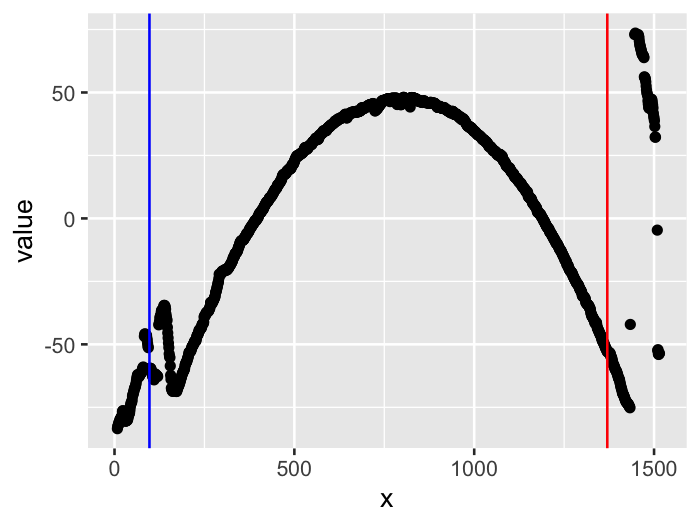
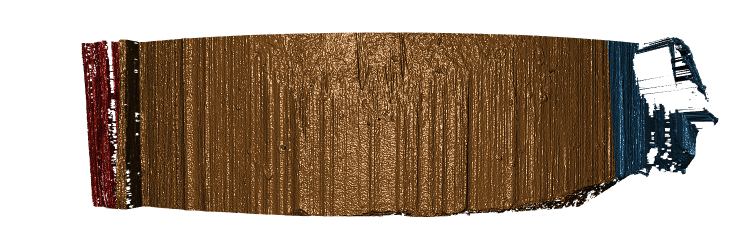

Hough transforms are a low-level computer vision algorithm used to detect basic shapes in an image array. The initial Hough transform was developed to detect a line in an image; since then, Hough transforms have been expanded to detect circles, polygons, and other complex shapes. For bullet processing, the borders of a groove engraved area are often deep linear divots in a bullet land, so Hough transforms are useful for distinguishing between land engraved areas (LEAs) and groove engraved areas (GEAs). In this vignette, we discuss the application of Hough transforms to locate GEAs, starting with bullet pre-processing; we also compare the Hough groove detection method to other existing methods for groove detection. 

# Bullet Pre-Processing

We will use demo data available in the `grooveFinder` package to demonstrate how to find grooves using Hough transforms. Unlike other methods available in `grooveFinder`, `get_grooves_hough` requires the entirety of the x3p for analysis, rather than the single or averaged crosscut profile used in other methods. See package `x3ptools` at https://heike.github.io/x3ptools/ for ways to convert different file formats into x3p standard files. The Hough grooves method uses the `imager` package under the hood, which requires external libraries `XQuartz` (on mac) and `ImageMagick` (on everything).

```{r libraries, warning = F, message= F}

# Load in Libraries

library(ggplot2) # Utilize to visualize cross cuts and bullet lands
library(dplyr) # Used to transform and cleaning up data
library(x3ptools) # Contains a host of useful functions for dealing with x3ps
library(imager) # Used for converting x3ps to cimgs and running the Hough transform
library(bulletxtrctr) 
library(grooveFinder) 
#library(fixedpoints) this package is used to run Canny Edge detection
```

The data we will be working with is from the Hamby 44 dataset from the NIST Research Ballistics Toolmarks data base (NRBTD)[https://tsapps.nist.gov/NRBTD/Studies/Search] These are commands loading the bullet scans into `R` without downloading the actual files.


```{r read-bullet}
# Load in data using weblinks
b1 <- read_bullet(urllist = hamby44demo[[1]])
b2 <- read_bullet(urllist = hamby44demo[[2]])
```

For ease of use we will combine the data into one dataframe.

```{r bullet-df}
b1$bullet <- 1
b2$bullet <- 2
b1$land <- 1:6
b2$land <- 1:6
bullets <- rbind(b1, b2)
```

The measurement of each scan should be in microns, however checking the units as shown below indicates that it is recorded in meters. 

```{r bullet-units}

# Check units
bullets$x3p[[1]]$header.info$incrementY

# Convert to microns
bullets <- bullets %>% mutate(
  x3p = x3p %>% purrr::map(.f = x3p_m_to_mum)
)

# Check units once more
bullets$x3p[[1]]$header.info$incrementY

```

Now that the land is in microns we can view the bullet land using the `image_x3p` functions from `x3ptools`. Notice how the very bottom part of the land has an area that looks fairly smooth.
We expect this smooth area to be at the top of the land, so we need to flip
the image over the x-axis. Supporting this conclusion, there is also a region of missing values at the top right; this region is called "breakoff" and occurs toward the bottom of the bullet (e.g. away from the tip). Thus, the breakoff should be in the bottom right corner of the scan.


```{r image-x3p-code, eval=FALSE}
image_x3p(bullets$x3p[[1]], file = "../man/figures/temp-before.png")
```
```{r image-x3p-pic, echo = FALSE}
knitr::include_graphics("../man/figures/temp-before.png")
```


```{r flip-x3p}
# flip scan so that the foot is at the bottom

bullets <- bullets %>% mutate(
  x3p = x3p %>% purrr::map(.f = function(x) x %>% 
                             y_flip_x3p())
)   
```

```{r image-x3p-flip-code, eval = F, echo = F}
image_x3p(bullets$x3p[[1]], file = "../man/figures/after-before.png")
```
```{r image-x3p-flip-pic, echo = F}
knitr::include_graphics("../man/figures/after-before.png")
```

Not all scans may be oriented or scaled in the same way as the data presented in this vignette, so viewing the image and image units should be carried out before each analysis.


## Motivating Example

Before we get into the specifics of the `get_grooves_hough` algorithm, we will demonstrate identifying groove locations on a single land in two and three dimensions.

```{r demo-hough-grooves}

# select only one x3p file from demo set
x3p <- bullets$x3p[[1]]

# obtain the groove functions for land 1
grooves <- get_grooves_hough(x3p,adjust = 150)

# extract an optimized crosscut of the bullet 
crosscut <- x3p %>% x3p_crosscut_optimize()
```

```{r visualize-cc, eval=FALSE}

# groove location at crosscut
hough.left <- grooves$left.groove.fit(crosscut) 

hough.right <- grooves$right.groove.fit(crosscut)

raster.cc <- imager:::as.data.frame.cimg(land) %>% filter(y == crosscut)
ggplot() +
  geom_point(data = raster.cc, aes(x = x, y = value)) +
  geom_vline(xintercept = hough.left, colour = "blue") +
  geom_vline(xintercept = hough.right, colour = "red") +
  guides(fill = FALSE)


```

```{r make-cc-motivation, eval=F, echo = F}
hough.left <- grooves$left.groove.fit(crosscut) 

hough.right <- grooves$right.groove.fit(crosscut)

raster.cc <- imager:::as.data.frame.cimg(as.cimg(x3p$surface.matrix)) %>% filter(y == crosscut)
ggplot() +
  geom_point(data = raster.cc, aes(x = x, y = value)) +
  geom_vline(xintercept = (hough.left+1)/x3p_get_scale(x3p), colour = "blue") +
  geom_vline(xintercept = (hough.right-1)/x3p_get_scale(x3p), colour = "red") +
  guides(fill = FALSE)
ggsave(filename = "../man/figures/cc-motivation.png", width = 4, height= 3, units = "in", dpi = 175)
```

```{r 2d-cc-viz-motivation, echo = F}

```

Here we can see a two-dimensional visualization of our groove estimates over a single crosscut of our bullet land. We notice that while the right groove appears to be pretty well identified we have some slight error with the left hand groove. To investigate further we view the three-dimension Hough estimate across the entire land using the `get_mask_hough` function from `grooveFinder`.

```{r 3d-viz-motivation-creation, eval = F}
new.viz <- get_mask_hough(x3p, grooves)
image_x3p(new.viz, file = "../man/figures/3d-viz-motivation.png")
```
```{r 3d-viz-motivation, echo = F}

```


# Application of the Hough Transform

There are essentially three steps wrapped into the `get_grooves_hough` function that are needed to identify GEAs using Hough transforms: 

1. creating an image gradient, 
2. applying the Hough transform, and 
3. selecting the best Hough estimate for the grooves. 

While all three of these steps are taken care of automatically within the function, it is useful to demonstrate how the algorithm works by exploring each step of the algorithm in more detail. 

## Scan to Image Conversion and Preprocessing

By applying the Hough transform (or any other image processing technique) to x3p scan data, we are in effect storing the so-called "two and a half dimensional" data (because we only have the surface of the object, instead of the full object including depth) as an image. Specifically, we use the x and y grid dimensions to define a grid of image pixels and encode the z dimension (e.g. depth) as the pixel intensity. Note that this conversion is distinct from the `image_x3p()` represenation of the scan as an image, as `image_x3p()` projects the scan into a 3D perspective view and adds lighting and surface coloring. Our image representation is much more basic and is numerically identical to the x3p surface matrix (though stored in a different format).

`grooveFinder` makes use of the `imager` package, which stores images in `Cimg` format. This is because imager imports a large majority of its processing from the `CImg` C++ library. In C++ a `CImg` is an image class able to represents datasets that have up to four dimensions. Thus, we can save our x3p surface matrix as a `Cimg` for processing. Since we are using `Cimg` it is worth noting that the y-axis is flipped from a traditional cartesian co-ordinate system. So the origin is in actuality in the top left-hand corner.

```{r convert-to-cimg}
land <- as.cimg(bullets$x3p[[1]]$surface.matrix)

# Save dimension size of the bullet land for use later
sizes <- dim(land)
width <- sizes[1] 
height <- sizes[2] 
```

```{r cimg-land-code, echo = FALSE, eval = FALSE}
raster <- imager:::as.data.frame.cimg(land)
ggplot() +
  geom_raster(data = raster, aes(x = x, y = -y, fill = value)) +
  coord_fixed() +
  scale_fill_gradientn(colours=c("#000000","#FFFFFF"))+ 
  guides(fill = FALSE)
ggsave(filename = "../man/figures/cimg-land.png", width = 4, height= 3, units = "in", dpi = 175)
```

```{r cimg-land-pic, echo = F}


```

Traditionally image cleaning functions are applied to the image before Hough transformation in order to emphasize subtle geometric features within the image and reduce the effect of noise. Typically images are first run through a Gaussian filter, which smoothes the image out; afterwards, Canny Edge detection is used to identify edges (regions of sharp change or contrast) within the image. The goal of these two processes is to eliminate extraneous features and/or noise, emphasizing only prominent lines. We have found that neither the Gaussian filter nor the Canny Edge detection process is necessary to identify bullet grooves (because there is relatively little random noise and the lines are already very prominent in most scans); thus, these steps have been removed to save processing time. 

For more information on the preprocessing techniques used in Hough transformation, see the (very useful) [vignettes](https://dahtah.github.io/imager/canny.html) from the `imager` package by Simon Barthelmé.

## Image Gradient

Now that we have a two dimensional image representation of our bullet land scan, we create an image gradient, which detects changes in direction, intensity, or shading of pixels in our image. Using this gradient, we select only values above the 99th percentile, removing detail from our image in preparation for the Hough transform. 

```{r img-gradient}
# Create gradient image from the c-image
dx <- imgradient(land, "x")
dy <- imgradient(land, "y")

grad.mag <- sqrt(dx^2 + dy^2)

# Filter gradient image so that only the strongest gradients are highlighted
strong <- grad.mag > quantile(grad.mag, .99, na.rm = TRUE )
```

The astute vignette reader may notice that the image class changes from a `Cimg` to a `pixset` after filter the gradient magnitude image. This is because the values in the `Cimg` are passed through a logical test and are thus saved as either TRUE or FALSE in the new image matrix. These matrices of boolean values are a new image class called a `pixset` which we can use to generate Hough estimates.


## Hough Transform Algorithm

Before continuing on with the Hough transform process, a discussion of the parametrization and process is necessary to facilitate understanding. The actual Hough algorithm cycles through every pixel of an inputed image, typically one that has undergone some sort of edge-detection. For every possible non-zero edge point, an equivalent sinusoidal curve is generated in the feature space. Consequently points on a line will generate sinusoidal curves that all intersect at a particular set of parameters that best describe the line detected. So not only does the Hough transform suggest parameters for edges detected it also yields a "score" which counts the number of lines that intersect at each point in the feature space, or roughly how many pixels in our image fall on the detected lines. 

A note about the feature space, since the slope of vertical lines in the x,y-plane is infinite the amount of memory required to store results in the feature space would make this algorithm unfeasible. So to manage with this problem, the Hough transform characterizes line in Hessian Normal form, meaning each line is described by a $\rho$ and a $\theta$ where $\rho$ is an orthogonal vector from the origin to a point on a detected line, and $\theta$ is the angle between the orthogonal vector and the postivie x-axis. 

```{r, echo = F}
knitr::include_graphics("../man/figures/hessian-example.png", dpi = 300)
```


These results are useful but in order to use the Hough transform we need to decide how to transform the $\rho$ and $\theta$ parameters back into the x,y-plane. We note that a link between these two parametrizations of lines is given by the following formula for the x and y intercepts:

$$\rho = x_o\cos(\theta) + y_o\sin(\theta)$$

Where $x_o$ is the x intercept and $y_o$ is the y-intercept. We can easily find the x-intercept of any Hough line by finding $\frac{\rho}{cos(\theta)}$. This is accomplished in a helper function called `rho_to_ab` which is not exported as part of the `groovFinder` package. We utilize this helper function to then find the points of each hough line where the Hough line intersects the top and bottom of each land. 


```{r, echo = FALSE, eval = FALSE}
library(cowplot)
library(grid)
library(png)
p <- ggplot() +
  geom_segment(aes(x =440, y = 0, xend = 60, yend = 300), lwd= 2, colour = "orange") +
  geom_segment(aes(x =0, y = 0, xend = 310, yend = 100), lwd= 2, colour = "deepskyblue1") +
  geom_curve(aes(x = 100, y = 0, xend = 50, yend = 19), lwd = 1, colour = "deepskyblue1", curvature = -0.7) + 
  geom_segment(aes(x = 260, y=82, xend = 290, yend = 63), lwd = 2, colour = "deepskyblue1") +
  geom_segment(aes(x = 335, y = 76, xend = 290, yend = 63), lwd = 2, colour = "deepskyblue1") +
  annotate('text', x = 150, y = 20, 
        label = "theta",parse = TRUE,size=6, colour = "#e6e0ff") +
    annotate('text', x = 150, y = 80, 
        label = "rho", parse = TRUE, size=6, colour = "#e6e0ff") +
  scale_y_reverse() +
  scale_x_continuous(limits = c(0, 1200), position = "top")


ggdraw() +
  draw_image("../man/figures/after-before.png", x = 0.05, y = 0, height = 1.25, width = 1) +
  draw_plot(p)

  


```

The top of the land, designated "xtop" in our code is simply the x-intercept calculated by `rho_to_ab`. The bottom of the land, designated "xbottom" is found geometrically. As shown in the figure below, we can draw a triangular shape between "xtop" the bottom of the bullet land and our supposed lower x-intercept for a Hough estimate. Given that we know the angle $\theta$ we can then find the location of "xbottom" by estimating $\delta$ shown in the image below and subtracting $\delta$, from the x-intercept called "xtop". We can find $\delta$ by using some geometric properties and the following equation: $(\text{height of the land}) * tan(\theta)$


```{r, echo = FALSE, eval = FALSE}
library(cowplot)
p <- ggplot() +
  geom_segment(aes(x =440, y = 0, xend = 60, yend = 300), lwd= 2, colour = "orange") +
  geom_segment(aes(x = 440, y = 0, xend = 440, yend = 163), lwd =2, colour = "orange")+
  geom_segment(aes(x = 440, y = 135, xend = 380, yend = 135), lwd = 2, colour = "orange") +
  geom_segment(aes(x = 385, y = 135, xend = 385, yend = 163), lwd = 2, colour = "orange") + 
  geom_curve(aes(x = 398, y = 30, xend = 440, yend = 40), lwd = 1, colour = "orange") +
  geom_segment(aes(x =0, y = 0, xend = 310, yend = 100), lwd= 2, colour = "deepskyblue1") +
  geom_curve(aes(x = 100, y = 0, xend = 50, yend = 19), lwd = 1, colour = "deepskyblue1", curvature = -0.7) + 
  geom_segment(aes(x = 260, y=82, xend = 290, yend = 63), lwd = 2, colour = "deepskyblue1") +
  geom_segment(aes(x = 335, y = 76, xend = 290, yend = 63), lwd = 2, colour = "deepskyblue1") +
  geom_segment(aes(x = 245, y = 162, xend = 448, yend = 162), lwd = 2, colour = "magenta3")+
  annotate('text', x = 350, y = 190,
           label = "delta", parse = TRUE, size = 6, colour = "#000000")+
  annotate('text', x = 170, y = 20, 
        label = "theta",parse = TRUE,size=6, colour = "#e6e0ff") +
  annotate('text', x = 150, y = 80, 
        label = "rho", parse = TRUE, size=6, colour = "#e6e0ff") +
  annotate('text', x = 405, y = 65, 
        label = "theta", parse = TRUE, size=6, colour = "#e6e0ff") +
  scale_y_reverse() +
  scale_x_continuous(limits = c(0, 1200), position = "top")


ggdraw() +
  draw_image("../man/figures/after-before.png", x = 0.05, y = 0, height = 1.2, width = 1) +
  draw_plot(p)

ggsave(filename = "../man/figures/calc-xbottom.png", width = 6, height = 3.5, units = "in")
```

```{r, echo = F}
knitr::include_graphics("../man/figures/calc-xbottom.png", dpi = 300)
```


We then find the slope in y of each Hough line by dividing the difference in x between "xtop" and "xbottom" by the height of the bullet land. We utilize the slope in y rather than the slope in x because it is numerically more robust. 

## Applying Hough Transform

Using the image gradient calculated during the preprocessing step, we begin the Hough transform process using the `hough_lines` function from `imager`^[Other implementations of Hough transforms in R include the `PET` package]. As discussed previously we are working with images in the `Cimg` class, so the origin is in the top-left corner of the image. However, since the `Cimg` is created from the surface matrix of an x3p file, it is indexed from 1 to the associated number of rows or columns in the surface matrix. But we would ideally like our image to be based around the origin so a "shift" is introduced in the `hough_line` function that simply shifts the indices of values by one unit so that the image is based from the origin. 

```{r}
# We want to get values with respect to (0,0) not (1,1)
 hough.df <- hough_line(strong, data.frame = TRUE, shift = FALSE) 


# Filter so that only vertical-ish lines are selected for communication
hough.df <- hough.df %>%
    dplyr::mutate(theta = ifelse(theta <= pi, theta, theta - 2 * pi)) %>%
    dplyr::filter(
      theta > (-pi / 16), # identify only vertical(ish) lines
      theta < (pi / 16)
    )
  hough.df <- unique(hough.df) # get rid of duplicates

```

The output we receive from the Hough transform comes in the form of a dataframe, where each row is a non-unique line detected parameterized in Hessian Normal form.  Originally, $\theta$ is presented between 0 and $2\pi$ which is hard for `R` to filter based on logical constraints and makes it hard for interpretation. So we re-formulate the $\theta$ parameter to be between $-\pi$ to $\pi$. Then we choose to filter out lines that are not fairly vertical so those with slopes greater than $\frac{-\pi}{16}$ and less than $\frac{\pi}{16}$. 

## Selecting the best Hough Line

The Hough transform outputs a score that can be interpreted as the number of points detected along a particular line through the image. Theoretically the strongest line detected in the image should be the groove locations. However, score alone is not a good enough metric to choose groove locations: we need to first normalize the score of each Hough line by dividing the score by the largest possible number of points detected in the line. We take into consideration only lines that intersect both the top and bottom of the scan, and find that the largest possible score for each Hough estimate would be: $\text{Height of the bullet land}/cos(\theta)$. So we divide each observed Hough score by the maximum score possible for lines at that angle. To select each groove we first select only Hough estimates below the lower one-fourth of the bullet land and grooves above the upper three-fourths of the land. 

```{r}

segments <- grooveFinder:::rho_to_ab(df = hough.df)

```

```{r}

segments <- segments %>%
    dplyr::mutate(
      xbottom = xintercept - height*tan(theta),
      xtop = xintercept,
      norm.score = score / (height/cos(theta)),
      slope_y = (xtop - xbottom)/height # Choosing to use slope in y because it is more robust
    ) %>%
    dplyr::arrange(desc(norm.score))
```


```{r}
 # Find the middle 1/2rds
  lfourth <- width / 4
  ufourth <- 3 * width / 4

  # separate into left and right sides and only take into account bullet lands that intersect with the image bottom

  segments.left <- segments %>%
    filter(rho < lfourth,
           xbottom > 0)

  segments.right <- segments %>%
    filter(rho > ufourth,
           xbottom < width)
  
  # select largest normalized score parametrization
  largest.norm.left <- segments.left[1,]
  largest.norm.right <- segments.right[1,]

```


These scores are then arranged in descending order and the line with the highest normalized Hough score is selected to be the estimated groove location. Once one line on each side is selected, we must reformulate our line estimates into functions so they can be applied to particular crosscuts or used to create a three-dimensional visualization. We note here that up until this point we have been working with our image data in terms of indices of the surface matrix as part of the x3p file. However, in order to produce the correct estimate for a bullet land crosscut, we need to transform our units from indices to microns. We do this by utilizing the helper function `pix_to_micron` using the following short equation:
$$ \text{micron} = \text{index} -1 \ * \ \text{x3p_get_scale(x3p)}$$
where the function `x3p_get_scale` from the bulletxtrctr package obtains the resolution of the x3p-scan. Since we have decided to use slopes in y we then calculate the equation of the line to describe the two sides of our bullet grooves we use "xbottom" (the point of lower x-intercept of Hough line) and then add the slope of the line with the largest normalized score multiplied by the y-input and subtract the user-specified adjustment. 

$$ \text{Estimated Groove Location = (pix_to_micron(xbottom) +  slope*y-input) - adjust}$$
We create individual functions for the left groove and the right groove and save the resulting sets of functions. If no groove is detected, `get_grooves_hough` should output a vertical line at the very edge of the land. 

```{r}
 # Crate two functions to calculate the x output for each y input
  left_groove_fit <- function(yinput) {
    assert_that(is.numeric(yinput))

    bottom.micron <- pix_to_micron(largest.norm.left$xbottom, land.x3p) # scale bottom.left to microns

    left.groove <- (bottom.micron + largest.norm.left$slope_y*yinput) + adjust

    return(left.groove)
  }


  right_groove_fit <- function(yinput) {
    assert_that(is.numeric(yinput))
    bottom.micron <- pix_to_micron(largest.norm.right$xbottom, land.x3p) # scale bottom.right to microns

    right.groove <- (bottom.micron + largest.norm.right$slope_y*yinput) - adjust

    return(right.groove)
  }

  grooves <- list(left.groove.fit = left_groove_fit, right.groove.fit = right_groove_fit)

```


# Results

Now that we have gone through every step of the process of obtaining Hough estimates we can apply our Hough grooves function over the entire dataset rather than just one observation with a few lines of code. Note, that in order to use the `get_hough_grooves` we need to transform the x3p into a dataframe. 

```{r}

# Obtain functions for estimating the left and right grooves of each bullet.
bullets <- bullets %>% mutate(
  grooves_hough = x3p %>% purrr::map(.f = x3p_to_df) %>%
    purrr::map(.f = get_grooves_hough)
)


```

Now that we have groove estimates, we should try and visualize what they look like and make any adjustments as necessary. For visualization purposes we will look at Hough groove estimates on a single crosscut by applying the `x3p_crosscut_optimize` function from the `bulletxtrctr` package to the x3p of each land. This may take a few seconds to process. Once we obtain the y-location of a suitable crosscut, we then need to obtain additional information to visualize each individual crosscut, we will call this data "ccdata".

```{r}
bullets <- bullets %>%
  mutate(
    crosscut = x3p %>% purrr::map_dbl(.f = x3p_crosscut_optimize),
    ccdata = purrr::map2(.x = x3p, .y = crosscut, 
                       .f = x3p_crosscut)
  )

```


The output of the `x3p_crosscut_optimize` function is a numeric value that indicates the vertical location of the ideal crosscut. To generate an actual estimate of the grooves for this crosscut we need to apply our generated left and right functions to each crosscut y-location.

```{r}
# Find the left and right groove locations for the particular cross cuts
bullets <- bullets %>%
  mutate(
    hough_left = purrr::map2_dbl(
      crosscut,
      grooves_hough, 
      .f = function(x, y) {
        y$left.groove.fit(x)
      }),
    hough_right = purrr::map2_dbl(
      crosscut,
      grooves_hough, 
      .f = function(x, y) {
        y$right.groove.fit(x)
      })
  )
```

Now we are ready to visualize our estimates over a single crosscut.

```{r, eval = F}


profilesplus <- bullets %>% tidyr::gather(type_side, location, matches("left|right")) %>%
  tidyr::separate(type_side, into=c("type", "side")) %>%
  tidyr::unnest(ccdata)  # gets rid of all the other list variables 


profilesplus %>% 
  ggplot(aes(x = x/1000, y = value)) +
  facet_grid(bullet~land) +
  geom_line() +
  geom_vline(aes(xintercept=location/1000, colour=type), size=0.75) +
  theme_bw() +
  scale_colour_brewer(palette="Paired") +
  theme(legend.position = "bottom") +
  xlab("Relative location (in millimeters)") +
  ylab("Relative height (in microns)")


```

```{r}
knitr::include_graphics("../man/figures/cc-before-adjust.png", dpi = 300)
```

Shown above are crosscuts taken from each land in our dataset. The grooves are the spikes on the left or right side of each curve. Ideally we want to identify the point just inside of each groove spike. Looking at these crosscuts, we can see that the estimates appear to be a little either too far to the left or right. For identifying grooves, it's far more problematic to have an estimate just outside of the grooves than just inside of the grooves. So let's re-run our Hough grooves functions, including an adjustment of 70. 

```{r}
# re-run Hough estimates with a larger adjust
bullets <- bullets %>% mutate(
  grooves_hough = x3p %>% purrr::map(.f = x3p_to_df) %>%
    purrr::map(.f = get_grooves_hough, adjust = 70)
)

# Find the left and right groove locations for the particular cross cuts
bullets <- bullets %>%
  mutate(
    hough_left = purrr::map2_dbl(
      crosscut,
      grooves_hough, 
      .f = function(x, y) {
        y$left.groove.fit(x)
      }),
    hough_right = purrr::map2_dbl(
      crosscut,
      grooves_hough, 
      .f = function(x, y) {
        y$right.groove.fit(x)
      })
  )
```

```{r, eval = F}

profilesplus <- bullets %>% tidyr::gather(type_side, location, matches("left|right")) %>%
  tidyr::separate(type_side, into=c("type", "side")) %>%
  tidyr::unnest(ccdata)  # gets rid of all the other list variables 


profilesplus %>% 
  ggplot(aes(x = x/1000, y = value)) +
  facet_grid(bullet~land) +
  geom_line() +
  geom_vline(aes(xintercept=location/1000, colour=type), size=0.75) +
  theme_bw() +
  scale_colour_brewer(palette="Paired") +
  theme(legend.position = "bottom") +
  xlab("Relative location (in millimeters)") +
  ylab("Relative height (in microns)")

```

```{r}
knitr::include_graphics("../man/figures/cc-after-adjust.png", dpi = 300)
```

After adjustment we can see a slight improvement in groove estimates with lines placed deeper into each bullet land. However, there are still some lands such as land 1 bullet 1 tht have problematic estimates. We can get a closer look at these bullet estimates by also visualizing this land in three-dimensions by using the `get_mask_hough` function from `grooveFinder`. To use `get_mask_hough` we need to input the x3p of the bullet land we wish to visualize and the groove functions created by `get_grooves_hough`. The ouput of `get_mask_hough` is a new x3p file that includes colorized portions of the bullet land when visualized using the `image_x3p` function from `bulletxtrctr`.

```{r, eval = F}

land1.bullet1 <- bullets$x3p[[1]]
grooves <- bullets$grooves_hough[[1]]

# Create mask visualization of groove estimates
new.visualization <- get_mask_hough(land1.bullet1, grooves)

# Only run if bulletxtrctr is loaded
image_x3p(new.visualization)
```

```{r, eval = F, echo = F}
image_x3p(new.visualization, file = "../man/figures/land1-viz.png")

```
```{r, echo = F}

```

Here we can see the Hough estimates across the entire bullet land. From the three dimensional visualization it is clear that the Hough estimate is not just inaccurate at the particular crosscut visualized earlier in this section, it is problematic across the entire land. 


